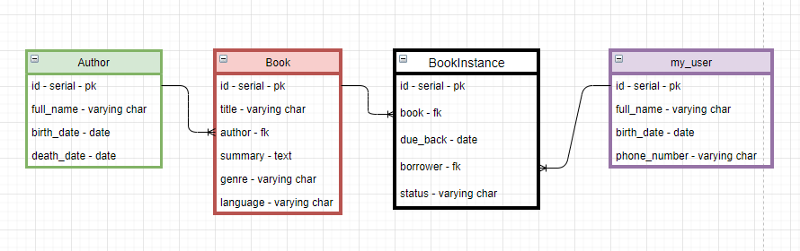

# Telegram bot + PostgreSQL
___

## Задание:

Придумать свою предметную область и продумать схему БД для неё.
Реализовать реляционную БД для своей предметной области(все таблицы должны быть 
не менее чем в третьей нормальной форме) 

###Критерии к БД: 

1) ✅ БД должна быть в третьей нормальной форме или выше;
    * в каждой клетке таблицы только 1 значение;
    * нет повторяющихся строк;
    * есть первичный ключ;
    * все атрибуты зависят от первичного ключа целиком, а не от какой-то его части;
    * все атрибуты зависят от первичного ключа, но не от других атрибутов;
    
2) ✅ Минимальное количество таблиц – 2; 

3) ✅ Все подключения из GUI должны осуществляться выделенным, не root, пользователем; 

4) ❌ Должен существовать как минимум один индекс, созданный вами по
   выбранному текстовому не ключевому полю; 

5) ❌ В одной из таблиц должно присутствовать поле, заполняемое/изменяемое 
   только триггером (например, «общая стоимость бронирования» в таблице «бронирования»,
   которое автоматически высчитывается при добавлении/изменении/удалении билетов, входящих
   в это бронирование) 

###Реализовать программу GUI со следующим функционалом: 

1) ✅ Создание базы данных (важно(!) именно create database, а не только create table) 

2) ✅Удаление базы данных 

3) ✅ Вывод содержимого таблиц 

4) ✅ Очистка(частичная — одной, и полная — всех) таблиц 

5) ✅ Добавление новых данных 

6) ✅ Поиск по заранее выбранному (вами) текстовому не ключевому полю 

7) ✅ Обновление кортежа 

8) ✅ Удаление по заранее выбранному текстовому не ключевому полю 

9) ✅ Удаление конкретной записи, выбранной пользователем 

10) ❌ Все функции должны быть реализованы как хранимые процедуры.

___

##[Видео с комментариями]()

___

##Основная база данных

Основная база данных содержит в себе информации о некотором устройстве библиотеки.

* Book - книга
* Author - автор книги
* BootInstance - конкретный экземпляр книги, который можно взять в библиотеке
* my_user - пользователь библиотеки, который может брать книги и обязан возвратить их

___

## Остальные базы данных

Кроме основной базы данных через GUI можно создавать другие, которые могут содержать
следующие поля:
* числовые 
* строковые
* дата
* внешний ключ

Также к любому полю можно добавить модификатор --not_null

___

## GUI

GUI в моей работе реализован с помощью асинхронного Telegram бота на Python.
Бот не присылает кучу сообщений, чтобы у пользователя не появлялось миллион сообщений.
Вместо этого интерфейс бота выполнен с помощью Inline кнопок привязанных к сообщениям,
которые привязаны к сообщениям.

Кроме заполнения таблицы с помощью отправки боту сообщения, также возможно отправить ему файл
формата CSV.

___

##Запуск

1) Создадим файл <ins>**conf.py**</ins> в корне проекта
2) В него нужно вписать следующие переменные:
   * USER - имя пользователя в базе данных
   * PASSWORD - пароль пользователя в базе данных
   * API_TOKEN - API токен выданный @BotFather
3) Скачиваем нужные зависимости

      pip install -r requirements.txt

4) Запускаем приложение
Windows:
   

      py main.py

Linux/MacOS:

      python3 main.py
